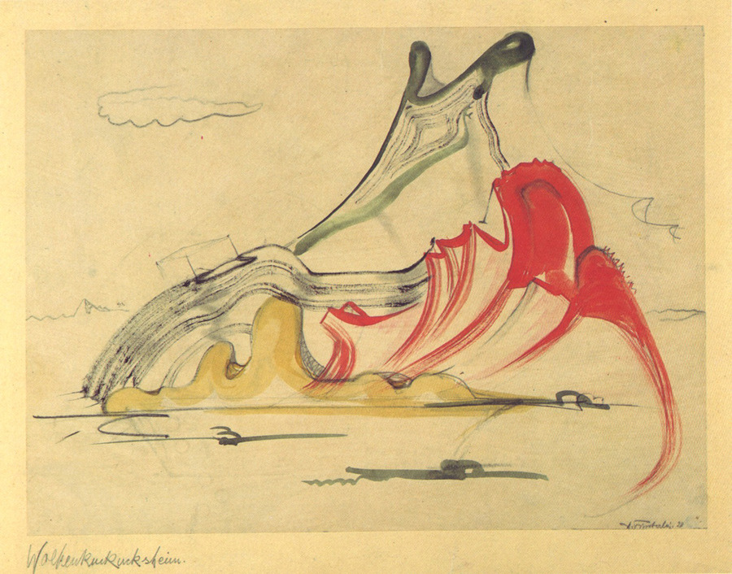

Hermann Finsterlin, <i>Wolkenkuckkucksheim</i>, 1920-24. Acquerello. Da Reinhard Döhl, <i>Hermann Finsterlin. Eine Annäherung</i>, Stoccarda: Hatje, 1988.

In basso a sinistra, a matita, Hermann Finsterlin annotò sul foglio una parola sola: *Wolkenkuckucksheim*. È il castello in aria dei tedeschi, la Cloud Cuckoo Land degli inglesi — la città che gli uccelli di Aristofane fondano a mezz'aria, troppo in alto per gli uomini, troppo in basso per gli dèi. Una parola che da venticinque secoli significa utopia, scritta sotto un acquerello come si scrive un indirizzo. Finsterlin ci abitò tutta la vita: non costruì nulla, non fu mai un architetto, e forse proprio per questo immaginò gli edifici più radicali del Novecento. I suoi disegni, prodotti di una febbre espressionista tra il 1919 e il 1924, mostrano interni che non hanno pareti, pavimenti o soffitti, ma solo cavità organiche che si gonfiano, si restringono e si aprono l'una nell'altra come gli organi di un corpo. L'abitante non cammina attraverso stanze — si muove «da organo a organo», come un globulo che circola, come un bolo che transita.

L'immagine è anatomica e deliberatamente inquietante. Dove Bernini avvolgeva lo spettatore in un'illusione di vitalità, Finsterlin elimina l'illusione: l'edificio non simula la vita, è vivo. Non ha la forma di un organismo — è un organismo, e chi lo abita ne è il contenuto biologico. Il corpo dell'abitante diventa un organo tra gli organi, indistinguibile dalla struttura che lo ospita. È la versione estrema di ciò che Harbison chiamerebbe privacy radicale: uno spazio così intimo da non lasciare margine tra il sé e il muro.

Finsterlin non costruì nulla, e questo è il punto. I suoi disegni funzionano come le conchiglie di Valéry: modelli di una perfezione impossibile da replicare nei materiali della costruzione umana. Un edificio fatto di organi richiederebbe materiali che crescono, si rigenerano, rispondono alla pressione — materiali biologici, non edilizi. 

Un secolo dopo, l'architettura computazionale promette esattamente questo: strutture che si ramificano, si adattano, rispondono all'ambiente come tessuti viventi. Ma anche quella è una simulazione — algoritmica, non organica. La differenza tra il termitaio e il grattacielo parametrico è che il termitaio respira davvero.

